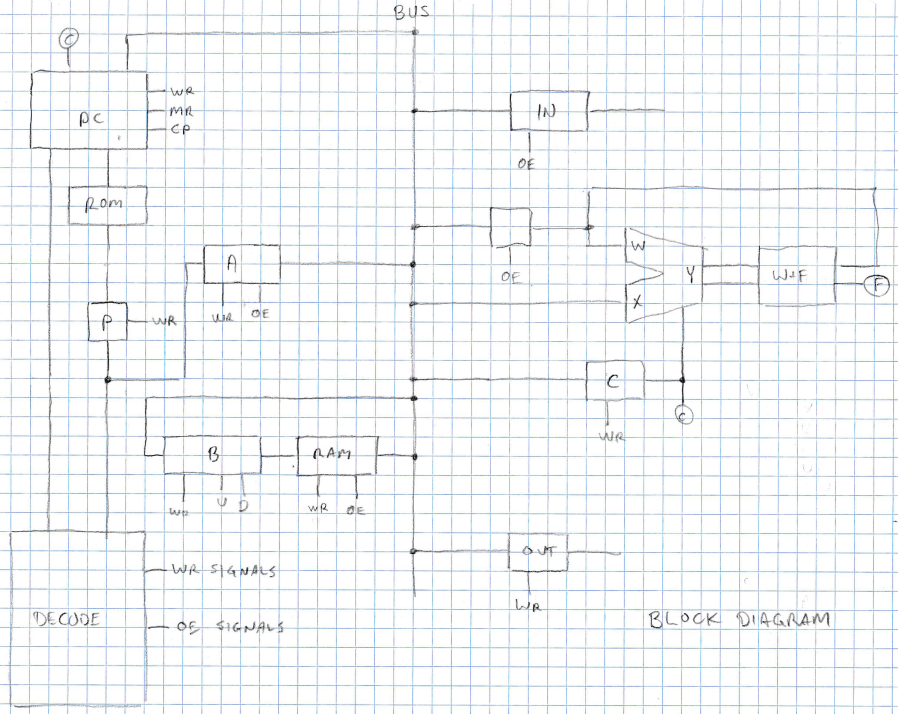
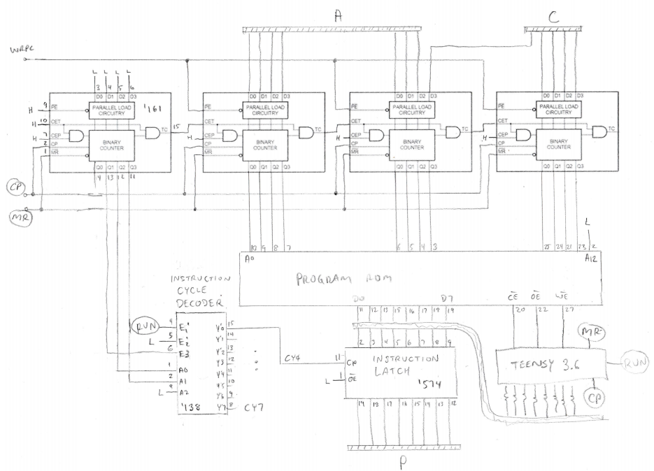
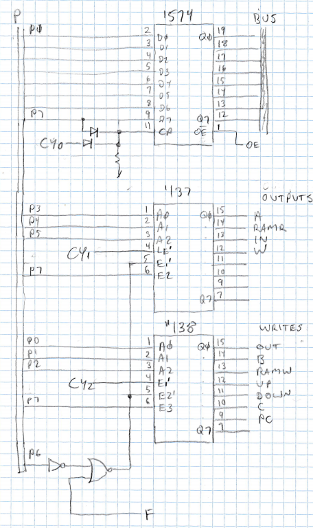
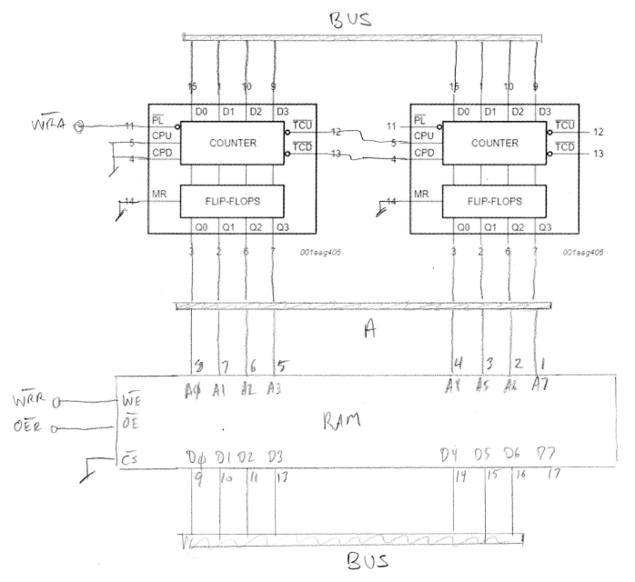
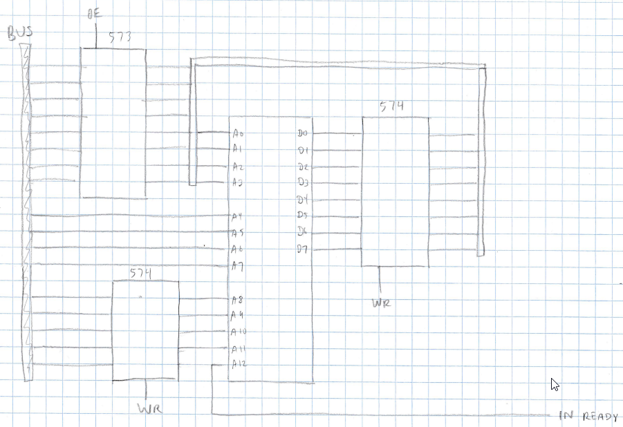

# RISC-IV 4-bit minicomputer

Francis Deck

## Overview

RISC-IV is a 4-bit RISC minicomputer built from logic chips and memory. I built it as a hobby project, and its design will continue to evolve. I've enlisted my son to figure out how to program it, which is going to be an awkward mess.

### Here are some specs:

* Harvard architecture
* 4k x 8 bit program EEPROM
* 128 x 7 bit RAM and stack-shaped object (SSO)
* Input and output ports
* BCD arithmetic
* 3 primitive instructions

## Support tools

I've created a primitive EEPROM loader using a microcontroller (MCU) board. That's its own project in the repository. Firmware on the MCU lets me load data into the EEPROM and step through the program. It includes a super-slow mode so I can watch the LED's and diagnose circuit problems.

The MCU will also drive the clock when the computer is running on its own, allowing me to experiment with clock frequencies for best behavior.

On my desktop PC, I've written some Python code to help me test my hardware, based on a basic 2 pass assembler. A Jupyter notebook includes unit tests for many of the basic functions.

## How it works

### The block diagram

It's best to look at the block diagram first, without any of the control signals, to see how data flows within the
machine. Also, we'll put off a chip level description until later. For now, just read the blocks as blocks.

#### Program counter (PC) and program EEPROM

The PC is a 16 bit counter. The high order 12 bits are the address for the program ROM.

The lower order 4 bits of the program counter break each instruction period into 16 time slices, to control the
sequence of operations within each instruction period. As it turns out, my design only needs 3 time slices, so the
clock input signal will run faster than the instruction rate by quite a bit.

#### Register P

The first time slice of each instruction period simply transfers the output of the ROM at the current program
address to the P register. The program word remains stable until the next instruction is loaded, even if the ROM
address changes during a jump instruction.

#### The bus

The bus is 8 bits wide, though not all bits are useful in every operation. But I had 8 colors of wire, and my memory
chips are 8 bits wide. Only one register at a time can drive the bus via its Output Enable (OE) signal. The output of
the selected register can be written to another register via its Write (WR) signal.

With a couple of exceptions, everything happens by moving something from one register to another via the bus.

#### Register A

Register A stores the instruction word during a LDA instruction. This allows the program to encode a literal value.
The output of A can be selected to drive the bus. All of bus drivers have "tri state" outputs, so that only one is
driving the bus at a time. The OE (output enable) signals determine which device is driving the bus.

#### Address pointer and RAM

Register B is actually an 8-bit up-down counter that can be loaded with a new value. It provides the address bits
to the RAM chip. Loading a value into B lets a program point to any address in RAM.

Incrementing and decrementing B allows the RAM to be used for array and stack operations.

#### Input port

Every computer needs to take input from the outside world. The IN register can drive the bus when its OE line is
asserted.

#### Output port

Likewise, a computer needs to make output. The OUT register is controlled by a Write (WR) signal.

#### The ALU

The ALU performs combinatorial operations, with an accumulator that feeds back into itself. The actual operations
supported by the ALU are programmed into an EEPROM chip, and are flexible. My preferred opcode set is
detailed below. The ALU contains 2 registers:

#### Register C

Register C stores a 5 bit operand used by the ALU. It is also used as the high order 5 bits of the jump address,
thus allowing for a 12 bit jump address overall.

#### Register W

Register W stores the output of the EEPROM, thus it is expected to function as an accumulator. Since the
EEPROM has 8 output bits, and only 4 can be used for arithmetic, the other 5 bits are open for interesting uses. I
am using bit 7 of the ALU output as a flag for conditional branching.Register W can also drive the bus.

### Circuit descriptions

#### Chip technology and nomenclature

Every designer has their own favorite logic family. My computer uses 74HC family chips, except for the EEPROM
and RAM, which are both mainstream CMOS parts.
74HC is a family of CMOS chips that are pin compatible with old 74LS TTL logic. CMOS has much lower power
consumption than TTL, plus it has high impedance inputs and low impedance, push-pull outputs. These
properties make it more breadboard friendly, by being able to drive higher load capacitance without the need for
termination components. Also, there are still a lot of 74HC types available in DIP packages.

To simplify notation, the chip family is assumed, so for instance a '138 is actually a 74HC138 chip, and "138" chips
from other families probably have the same functionality.

You'll notice that I've played fast and loose with the signal polarity on clock lines, such as at the inputs of the
latches. I can get away with this because the 4 instruction time slices are separated by a clock cycle. So it doesn't
matter whether latching occurs at the start or end of a slice. This trick eliminates having to use inverters all over
the place to set the correct polarity of each signal.

#### Program counter, EEPROM, Register P, and instruction cycle decoder

The program counter is 4 '161 binary counter chips, chained together. The first counter provides the lower order
4 bits of the counter, which determine the time slice within each instruction cycle. The upper 12 bits are a
traditional program counter, which address the program EEPROM. In addition, a 12 bit address can be forced into
the program counter by asserting the WRPC signal. 
The CP and MR signals are the clock pulse and master reset.

The program ROM is a 4k x 8 parallel EEPROM.

A '138 decoder divides each instruction cycle into 4 time slices, CY0 through CY3. Each of these signals is driven
LOW during one clock cycle, and returns to a HIGH state before the next one is driven LOW.

The first slice writes the output of the program EEPROM into the instruction register, a '574 octal latch.

A "Teensy 3.6" microcontroller board drives all of the EEPROM control signals, the master reset, and the clock
pulse. It connects to the data lines through series resistors that protect the Teensy from 5-Volt signals, and
effectively take it out of circuit while the program is running. The Teensy can also step through the program
addresses and write a new program to the EEPROM. This will be included as a stand-alone design in the repository.

#### Instruction decoder and Register A

The 7th program bit, P7, identifies the type of instruction. With P7 = 0, a wired OR gate clocks a '574 octal latch,
which forms Register A. The OR function decodes the LDA instruction.
If P7 = 1, a pair of decoders are activated. The first is a latching decoder, and receives the source register address
from 3 bits of the program word during cycle CY1.

The second is a non-latching decoder, and receives the destination address from 3 bits of the program word
during cycle CY2.P6 controls conditional execution. If P6 = 0, then both decoders are activated. If P6 = 1, then the decoders are
only activated if F = 1. This is the flag for conditional branching.

#### RAM circuit

A pair of '193 up-down counters are chained to form an 8-b up-down counter with preload. The WRA signal
loads the counter with the value on the bus. 

The UP and DOWN signals raise and lower the count by 1 unit.
The counter drives the address inputs of a parallel RAM chip. 

The WRR signal writes a value from the bus to the
current address. The OER signal drives the bus with the value stored value in RAM.

#### ALU

#### Ports

## Programmer's guide

### Summary of registers used in programming

#### A

Register A holds a literal loaded from an LDA instruction. It can range from 0 to 127. Not all values are used by all
of the other instructions. For instance, the ALU works on only 4 bit operands.

	LDA 12 ; load value of 12 into register A
	
#### B

Register B is the RAM address pointer. It can be loaded with a value by the program, but can also be incremented
and decremented by MOV UP and MOV DOWN instructions. These instructions allow B to be used as a primitive
stack for variables or jump addresses.

	MOV A B ; copy value in register A to register B
	MOV UP ; increment register B by one unit
	MOV DOWN ; decrement register B by one unit

#### C

Register C is the ALU opcode, but also serves as the "extra" 5 bits of the jump address.

	LDA 12 ; load value of 12 into register A
	MOV A C ; copy value in register A to register C
	
#### RAMR and RAMW

The RAM can be both read and written, so it can be treated as both a source and as a destination in MOV
instructions. They have to be coded differently, so I've given them separate mnemonics: RAMR (RAM Read) and RAMW (RAM Write) for these functions. The address bits of
the RAM always come from Register B.

	; Copy the value in RAM address 12 to the output register
	LDA 12
	MOV A B
	MOV RAMR OUT

#### W

Register W is the ALU accumulator. Its input is not the bus; instead, it receives the output of the ALU
combinatorial logic. In turn, its output is fed back into the combinatorial logic.

	; Store the output of the ALU in RAM address 12
	LDA 12
	MOV A B
	MOV W RAMW

#### IN

IN is the input port. It can be up to 8 bits wide, but it's not entirely clear what can be done with more than 4 bits
of it.

#### OUT

OUT is the output port. It can be up to 8 bits wide, but it's not entirely clear what can be done with more than 4
bits of it.

#### F

F is the Flag bit. When set to 1 by the ALU, it allows a jump to occur.

### Instruction Set

The mnemonics are just the ones that I've come up to help me make sense of my test programs. You can choose
any nomeclature that makes sense to you!

#### LDA = Load register A

Binary format: 0aaaaaaa

Decimal format: 0 + a

a = 7 bit literal value, i.e., from 0 to 127

Description: LDA transfers a 7 bit literal value into the A register. This is the only way to encode literal data in a
program.

#### MOV = Move

Binary format: 1csssddd

Decimal format: 128 + 64c + 8s + d

c = Condition, 0 or 1

0. Instruction executes unconditionally

1. Instruction excutes if flag bit F is set, otherwise instruction is skipped

s = Source, from 0 to 7:

0. A: Register A
1. RAMR = RAM output
2. IN = Input port
3. W = Register W, the ALU accumulator

d = Destination, from 0 to 7:

0. OUT = Output port
1. B = Register B (RAM address pointer)
2. RAMW = RAM input
3. UP = Increment register B (source is ignored)
4. DOWN = Decrement register B (source is ignored)
5. C = Register C (ALU opcode and high order jump address bits)
6. PC = Program counter (jump instruction)

Description: Not all combinations of source and destination are useful. Most combinations involving transferring
data from a source to a destination. There are also some special destinations:

PC is the program counter, a 12 bit register. It receives 7 bits of data from the bus and the other 5 bits from
register C. Sure, you can move data from the input port to the program counter.

UP and DOWN have no data source. They increment and decrement the B register by one unit.

## ALU operations, alpha build

Because the ALU operations are "soft," they might change at any moment, but I needed just a handful of opcodes
so I could try writing software.

The ALU is built around an EEPROM chip with 13 address lines and 8 data lines. How you use these lines is up to
your creativity, but I'm going to assign the first 8 address lines to a pair of 4 bit operands, labeled W and X. This
leaves up to 5 lines for an opcode, fed by the C register.

I'm also going to assign the 7th output line and accumulator bit to a flag bit, F, which will be used for conditional branching. The lower 4 bits will be labeled Y. For now the opcodes will be:

0. LOAD, Y = X
1. ADD, Y = W + X, F = Carry bit
2. SUB, Y = W - X, F = Borrow bit
3. EQ, F = (Y == W)
4. NE, F = (Y != W)
5. LT, F = (Y < W)
6. GT, F = (Y > W